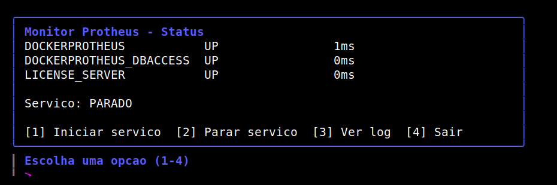
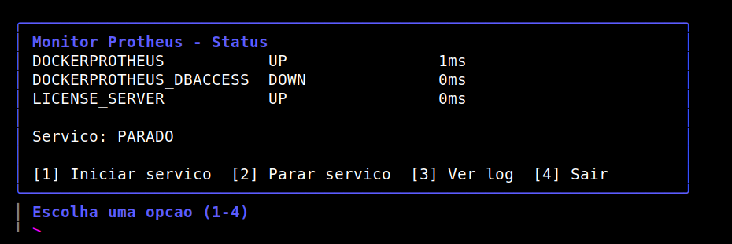
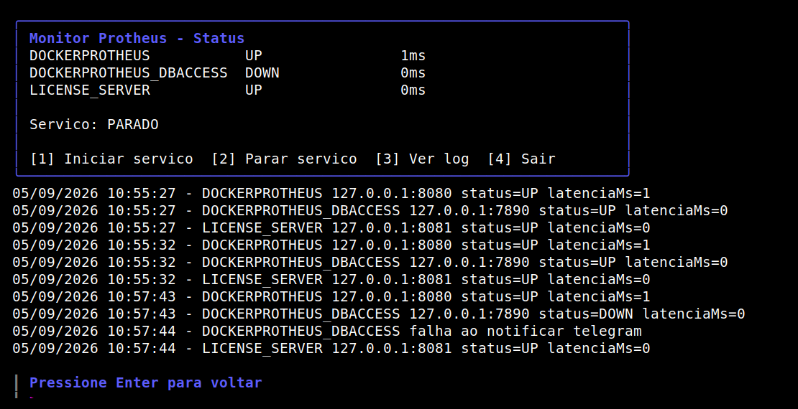

# Monitor de Unidades Protheus

Vigia o appserver web de cada unidade Protheus listada num `.ini` de
conexão existente — checagem HTTP (`GET` simples numa porta fixa) com
medição de latência — e avisa no Telegram quando uma unidade cai ou
volta. Opcionalmente também vigia o dbaccess de cada unidade (mesmo
host do appserver, porta configurável, checagem TCP) e um license
server centralizado (único para todo o ambiente, checagem TCP) — ver
`portaDbaccess`/`licenseServer` em "Configurar" abaixo.

O monitor roda como um serviço de fundo (`MonitorService.exe`, sem
interface, pensado pra ficar sempre ligado) e tem, à parte, um painel
interativo (`MonitorTUI.exe`, aberto via `abrir-painel.bat`) que mostra
o status/latência de cada unidade e permite iniciar/parar o serviço e
ver o log — os dois são executáveis separados, o painel não substitui
o serviço.

## Painel (`MonitorTUI.exe`)

Capturas reais do painel rodando contra um ambiente Protheus de verdade
(appserver, dbaccess e license server em containers Docker) — sem
mockup, é a saída de tela de fato:

**Todos os serviços no ar:**

**Uma queda real detectada** (o container do dbaccess foi parado
propositalmente pra este teste — o appserver e o license server
continuam corretamente isolados, ainda UP):

**Tela de log** (opção `[3]`), mostrando o histórico de checagens e a
tentativa de notificação no momento exato da queda:

## Instalar

1. Baixe o zip mais recente da aba Releases deste repositório
   (`monitor-windows-amd64`) — contém `MonitorService.exe`,
   `MonitorTUI.exe`, `config.example.json` e `abrir-painel.bat`, todos
   já compilados. Nenhum toolchain (MinGW, Go, AdvPP) precisa ser
   instalado na máquina Windows que vai rodar o monitor.
2. Copie os quatro arquivos pra uma pasta fixa (ex:
   `C:\MonitorProtheus\`).
3. Copie `config.example.json` para `config.json` na mesma pasta e
   preencha (ver "Configurar" abaixo).

## Configurar

Copie `config.example.json` para `config.json` na mesma pasta dos executáveis
e preencha:

- `iniPath`: caminho completo do `.ini` de conexão do SmartClient na
  máquina Windows (ex: `C:\\totvs\\appserver.ini`).
- `telegramBotToken` / `telegramChatId`: credenciais do bot do Telegram
  que vai mandar os alertas.
- `unidades`: lista dos nomes de seção do `.ini` a vigiar (ex: `TCPSP`,
  `TCPRJ`, ...).
- `intervaloSegundos` / `timeoutMs`: frequência da checagem e timeout
  de cada tentativa de checagem (tanto do `GET` HTTP do appserver
  quanto das checagens TCP de dbaccess/license server). `timeoutMs` é
  convertido internamente para segundos inteiros, sempre arredondado
  pra cima e com no mínimo 1 segundo — ou seja, `timeoutMs: 500` vira
  1 segundo de timeout, não "0 segundos" (que a biblioteca HTTP trata
  como "sem timeout configurado", 30s por padrão).
- `portaWebapp`: porta HTTP fixa (ex: `8090`) usada pra checar o appserver
  de cada unidade — o host continua vindo do `.ini` (`Server=` da seção),
  só a porta muda de "a porta do `.ini`" pra essa, fixa. A checagem faz um
  `GET` simples e mede quanto tempo demorou pra responder; qualquer status
  HTTP abaixo de 500 conta como "no ar".
- `portaDbaccess` (opcional): porta do dbaccess, igual pra todas as
  unidades — o host usado é o mesmo host do appserver daquela unidade,
  lido do `.ini`. Se essa chave não existir no `config.json`, o dbaccess
  não é checado.
- `licenseServer` (opcional): objeto `{"host": "...", "port": ...}` do
  license server, único pra todo o ambiente (não é por unidade). Se essa
  chave não existir, o license server não é checado.

Alertas de dbaccess saem como `TCPSP dbaccess (host:porta) caiu/voltou`
e de license server como `License Server (host:porta) caiu/voltou`; o
estado de cada um fica guardado em `state.json` sob as chaves
`<UNIDADE>_DBACCESS` e `LICENSE_SERVER`, respectivamente — não colidem
com a chave da própria unidade (appserver).

## Rodar os testes

`tests/monitor_lib_test.prw` cobre `src/monitor_lib.prw` (checagem HTTP
do appserver com latência, checagem TCP de dbaccess/license server,
estado, config, log, montagem de mensagem e os ciclos de
`MonProcessarUnidade`/`MonProcessarDbaccess`/`MonProcessarLicenseServer`).
Vários testes (`teste1`, `teste35`, `teste39`, `teste40`...) precisam de
um servidor HTTP real escutando em `127.0.0.1:19191` antes de rodar a
suite — a checagem do appserver faz um `GET` de verdade, então um
listener TCP cru que só aceita e fecha a conexão não serve (a
requisição HTTP não recebe resposta válida e o teste lê como caído).
Os demais testes usam portas que ninguém escuta de propósito, então não
precisam de setup.

`tests/monitor_tui_lib_test.prw` cobre `src/monitor_tui_lib.prw`
(montagem das linhas/tabela da TUI, detecção de processo rodando) — é
só função pura sobre strings e JSON, sem nenhuma chamada de rede, então
não precisa do listener.

1. Suba um servidor HTTP descartável na porta 19191 (fica escutando até
   você matar o processo com Ctrl+C):

       python3 -c "
       import http.server
       class H(http.server.BaseHTTPRequestHandler):
           def do_GET(self):
               self.send_response(200); self.end_headers(); self.wfile.write(b'ok')
           def log_message(self, *a): pass
       http.server.HTTPServer(('127.0.0.1', 19191), H).serve_forever()
       "

2. Em outro terminal, rode as duas suites (ajuste o caminho do `advplc`
   pra onde ele estiver instalado):

       cd tests && /caminho/para/advplc run monitor_lib_test.prw
       cd tests && /caminho/para/advplc run monitor_tui_lib_test.prw

3. A última linha da saída de cada suite deve ser `MONITOR_LIB_TEST_FIM`
   ou `MONITOR_TUI_LIB_TEST_FIM`, sem nenhuma linha de erro do
   compilador/interpretador acima dela. Cada asserção individual aparece
   como `testeN_descricao=SIM|NAO` (ou o valor esperado, ex:
   `teste45_latencia_arredondada=1`) — releia a saída se algo não bater.

## Rodar

- **Serviço de fundo**: agende `MonitorService.exe` no Task Scheduler
  do Windows como "ao iniciar o sistema", com "Start in" apontando pra
  essa mesma pasta (os arquivos `config.json`/`state.json`/
  `monitor.log` são caminhos relativos). Sobrevive a reboot e a troca
  de sessão RDP.
- **Painel de controle**: sempre abra **`abrir-painel.bat`**, nunca
  `MonitorTUI.exe` diretamente — o `.bat` garante que a interface abre
  dentro de um console de texto; aberto direto (duplo-clique), o
  interpretador entende que deve abrir uma janela gráfica em vez do
  painel ASCII. Do painel dá pra ver o status/latência de cada
  unidade, iniciar/parar o `MonitorService`, e ver as últimas linhas
  do log — tudo com teclado, sem precisar saber nenhum comando.
  **O painel ainda não tem uma tela pra editar a configuração** —
  `config.json` continua sendo editado à mão, com um editor de texto
  qualquer, fora do painel (essa é uma lacuna conhecida, não uma
  omissão de documentação).

## Licença

[Apache License 2.0](LICENSE).
