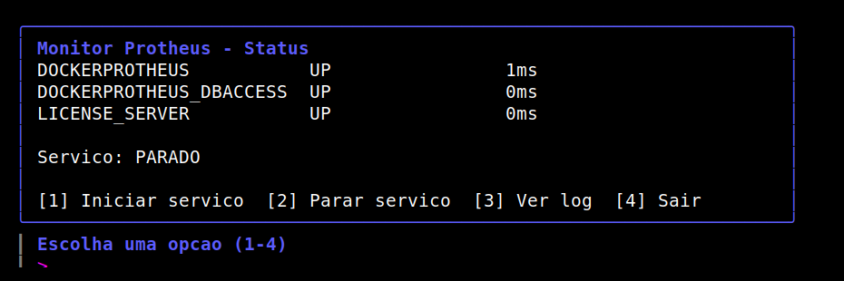
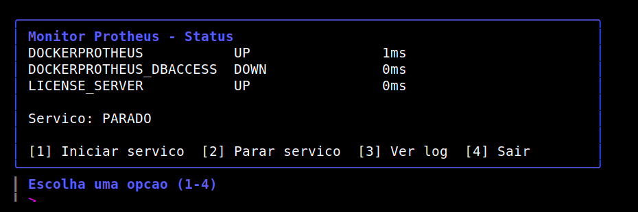
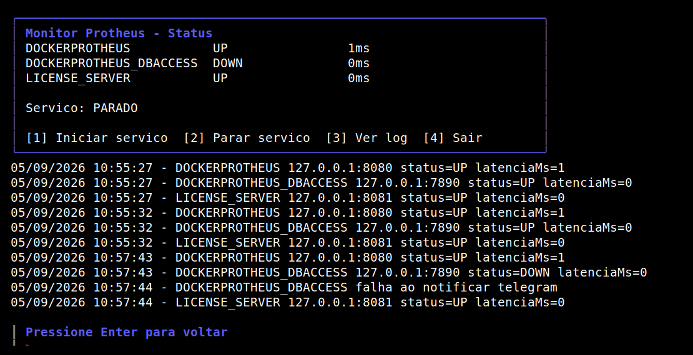
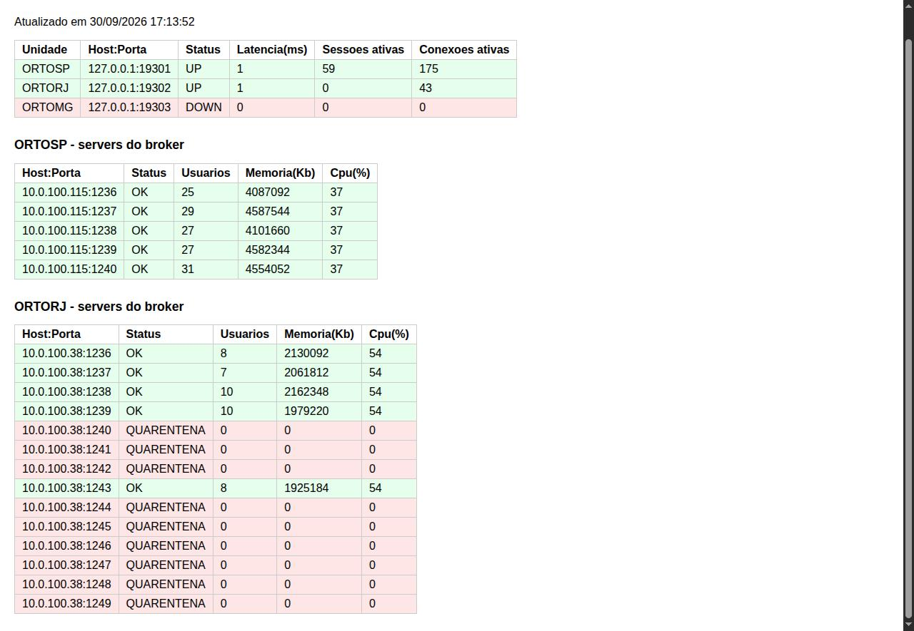

# Monitor de Unidades Protheus

Vigia o TOTVS Broker de cada unidade Protheus listada em `config.json`
(nome, host e porta — 100% parametrizável, sem depender de nenhum `.ini`
de conexão) — checagem HTTP no endpoint `/totvs_broker_query`, com
medição de latência, e interpreta o HTML de resposta do broker
(sessões/conexões ativas, e a tabela de servers, incluindo servers
individuais que caem em quarentena) — avisa no Telegram quando a
unidade inteira cai/volta e quando um server individual entra/sai de
quarentena. Opcionalmente também vigia o dbaccess de cada unidade
(mesmo host do appserver, porta configurável, checagem TCP) e um
license server centralizado (único para todo o ambiente, checagem TCP)
— ver `portaDbaccess`/`licenseServer` em "Configurar" abaixo. Um
dashboard web consolidado (ver "Dashboard web" abaixo) reúne tudo isso
numa única página.

O monitor roda como um serviço de fundo (`MonitorService.exe`, sem
interface, pensado pra ficar sempre ligado) e tem, à parte, um painel
interativo (`MonitorTUI.exe`, aberto via `abrir-painel.bat`) que mostra
o status/latência de cada unidade e permite iniciar/parar o serviço e
ver o log — os dois são executáveis separados, o painel não substitui
o serviço.

## Painel (`MonitorTUI.exe`)

Capturas reais do painel rodando contra um ambiente Protheus de verdade
(appserver, dbaccess e license server em containers Docker) — sem
mockup, é a saída de tela de fato:

**Todos os serviços no ar:**

**Uma queda real detectada** (o container do dbaccess foi parado
propositalmente pra este teste — o appserver e o license server
continuam corretamente isolados, ainda UP):

**Tela de log** (opção `[3]`), mostrando o histórico de checagens e a
tentativa de notificação no momento exato da queda:

## Instalar

**Windows**: baixe `Monitor-Setup-x.y.z.exe` da aba Releases e rode —
instala em `Program Files\MonitorProtheus`, cria atalho no Menu Iniciar
apontando pro painel. Alternativa sem instalador: baixe
`monitor-windows-amd64.zip`, extraia numa pasta de sua escolha.

**Linux/macOS**: rode

    curl -fsSL https://raw.githubusercontent.com/peder1981/monitor/master/install.sh | sh

Instala em `~/.local/bin` (sem precisar de root). Pra escolher outro
diretório: `MONITOR_INSTALL_DIR=/outro/caminho curl -fsSL ... | sh`.
Alternativa sem o script: baixe `monitor-linux-amd64.tar.gz` ou
`monitor-darwin-arm64.tar.gz` da aba Releases e extraia manualmente.

Nenhuma das três plataformas precisa instalar toolchain nenhum (MinGW,
Go, AdvPP) — os binários já saem compilados da CI.

## Configurar

Copie `config.example.json` para `config.json` na mesma pasta dos executáveis
e preencha:

- `unidades`: lista de objetos `{"nome": "...", "host": "...", "porta": ...}`
  — uma entrada por unidade a vigiar. `nome` é o rótulo usado nos logs e
  alertas (livre, sem precisar bater com nada externo); `host`/`porta`
  apontam direto pro TOTVS Broker daquela unidade. Adicionar, remover ou
  mudar IP/porta de uma unidade é só editar essa lista — não depende de
  nenhum `.ini` de conexão do SmartClient. Cada unidade aceita também um
  `"endpoint"` opcional (ex: `"/totvs_broker_query/status"`) pra quando o
  broker daquela unidade expõe o status num caminho diferente do padrão
  `/totvs_broker_query` — achado de campo: bases em build mais antiga
  (ex: 12.1.2310) usam esse caminho alternativo. Sem essa chave, usa o
  padrão. **Esse campo só pode ser editado direto no `config.json`** — o
  formulário de edição pelo dashboard web (ver "Editar unidades pelo
  dashboard" abaixo) só mexe em nome/host/porta.
- `telegramBotToken` / `telegramChatId`: credenciais do bot do Telegram
  que vai mandar os alertas.
- `intervaloSegundos` / `timeoutMs`: frequência da checagem e timeout
  de cada tentativa (tanto do `GET` HTTP do broker quanto das checagens
  TCP de dbaccess/license server). `timeoutMs` é convertido internamente
  para segundos inteiros, sempre arredondado pra cima e com no mínimo 1
  segundo.
- `dashboardPorta`: porta HTTP local onde o dashboard web consolidado
  fica disponível (ver "Dashboard web" abaixo). Se ausente ou inválida,
  o `MonitorService` loga um aviso e roda normalmente sem o dashboard —
  as checagens e os alertas do Telegram não dependem disso.
- `dashboardSenha` (opcional): senha pra habilitar a edição de unidades
  pelo dashboard web (ver "Editar unidades pelo dashboard" abaixo). Sem
  essa chave, o dashboard fica só leitura — a página de edição aparece,
  mas não salva nada.
- `portaDbaccess` (opcional): porta do dbaccess, igual pra todas as
  unidades — o host usado é o mesmo host da unidade. Se essa chave não
  existir no `config.json`, o dbaccess não é checado.
- `licenseServer` (opcional): objeto `{"host": "...", "port": ...}` do
  license server, único pra todo o ambiente (não é por unidade). Se essa
  chave não existir, o license server não é checado.

Cada unidade é checada em `http://<host>:<porta>/totvs_broker_query` —
o mesmo endpoint que a página de status do TOTVS Broker usa. **O broker
devolve formatos diferentes dependendo de quem pergunta**: um navegador
recebe uma página HTML; o `FWHttpGet` do monitor (que não manda os
headers que um navegador manda) recebe **JSON** — confirmado em campo
contra um broker real (achado pós-deploy, 2026-09-30). O monitor detecta
os dois formatos automaticamente (`MonParseBrokerResposta`): tenta JSON
primeiro (é o que realmente chega em produção, e é estritamente melhor —
tem `inquarantine`/`disabled` como booleano de verdade, não precisa
inferir de texto de coluna), cai pro parser de HTML se o corpo não for
JSON de broker. A unidade conta como `UP` quando o HTTP responde com
status abaixo de 500 **e** o corpo é reconhecivelmente um broker (JSON
com a chave `servers`, ou HTML com o título do broker) — protege contra
"o host respondeu alguma coisa, mas não é o broker" virar um falso UP.

Servers individuais da tabela do broker que entram em quarentena ou são
desabilitados geram um alerta próprio, granular por `host:porta` do
server — independente do alerta de broker inteiro cair/voltar. O status
de cada server é `OK`/`QUARENTENA`/`DESABILITADO` (via JSON: booleanos
`inquarantine`/`disabled`; via HTML: só `OK`/`QUARENTENA`, lido da
coluna "Quarentena"/"Início ocorrência" — o HTML não expõe um estado de
"desabilitado" separado). **Limitação conhecida:** o campo de motivo
(`disabled_reasons` no JSON, `Motivos` no HTML) nunca foi observado com
conteúdo em nenhum ambiente de teste ou captura real — é capturado e
aparece no alerta quando vier preenchido, mas seu formato real não está
validado. O estado "bloqueado por escalabilidade", mencionado na
documentação original do broker, não aparece em nenhuma captura real
(JSON ou HTML) observada até agora e não é distinguido nesta versão.

Alertas de dbaccess saem como `TCPSP dbaccess (host:porta) caiu/voltou`
e de license server como `License Server (host:porta) caiu/voltou`; o
estado de cada um fica guardado em `state.json` sob as chaves
`<UNIDADE>_DBACCESS` e `LICENSE_SERVER`, respectivamente — não colidem
com a chave da própria unidade (broker).

## Dashboard web

Com `dashboardPorta` configurada, o próprio `MonitorService` (o mesmo
processo de fundo que faz as checagens) sobe um servidor HTTP local
nessa porta — acesse `http://<host-onde-o-monitor-roda>:<dashboardPorta>/`
de qualquer navegador na rede pra ver uma página consolidada com todas
as unidades: status, latência, sessões/conexões ativas do broker, e uma
tabela por unidade com os servers individuais (incluindo os que estão
em quarentena). A página recarrega periodicamente sozinha e reflete
sempre o resultado do ciclo de checagem mais recente — não é preciso
reiniciar nada pra ela atualizar.

Captura real da página (ambiente de demonstração — duas unidades no ar,
uma fora, e um server em quarentena aparecendo na tabela da unidade
ORTORJ):

### Editar unidades pelo dashboard

A página tem um link **"Configurar unidades"** que leva a um formulário
(`/config`) pra adicionar, remover ou mudar host/porta das unidades
monitoradas — uma por linha, formato `NOME HOST PORTA`. Salvar exige uma
senha (chave `dashboardSenha` no `config.json` — texto livre, qualquer
valor serve). Sem essa chave no `config.json`, a edição fica desabilitada
(o formulário aparece, mas o botão "Salvar" fica travado). A mudança vale
a partir do próximo ciclo de checagem — o `MonitorService` relê o
`config.json` a cada ciclo, **não precisa reiniciar o serviço**.

**Limitação de segurança, documentada com transparência:** essa "senha"
não é HTTP Basic Auth de verdade nem um controle de acesso forte — é só
um campo de formulário comparado no servidor. Três motivos técnicos
concretos: (1) o servidor HTTP embutido no AdvPP não expõe headers da
requisição pro código AdvPL, então não dá pra ler um cabeçalho
`Authorization`; (2) o mesmo servidor só aceita corpo de requisição em
JSON, e um `<form>` HTML comum não consegue montar isso — por isso o
formulário usa `GET` em vez de `POST`, o que deixa a senha e a lista de
unidades visíveis na URL e no histórico do navegador; (3) todo o
dashboard roda em HTTP puro, sem TLS, então qualquer coisa nessa rede
capturando tráfego vê a senha em texto claro. Trate como uma barreira
contra edição acidental/casual por alguém sem querer, não como proteção
contra alguém malicioso com acesso à rede `10.0.100.x`.

## Rodar os testes

`tests/monitor_lib_test.prw` cobre `src/monitor_lib.prw` (checagem TCP
de dbaccess/license server, estado, config, log, montagem de mensagem).
`tests/monitor_broker_test.prw` cobre `src/monitor_broker.prw` (parser
do HTML e do JSON do TOTVS Broker contra três fixtures reais em
`tests/fixtures/` — HTML saudável, HTML com 9 de 14 servers em
quarentena, e JSON real de produção —, a checagem via
`/totvs_broker_query`, o alerta granular por server nos três estados
OK/QUARENTENA/DESABILITADO, e o dispatcher que escolhe JSON ou HTML
automaticamente).
`tests/monitor_dashboard_test.prw` cobre `src/monitor_dashboard.prw`
(geração do HTML consolidado e da rota HTTP, sem precisar de rede —
`MonServirDashboard`, que sobe o servidor de verdade, é testado
manualmente). `tests/monitor_config_ui_test.prw` cobre
`src/monitor_config_ui.prw` (parser do formulário de texto pra lista de
unidades, round-trip completo de gravação do `config.json` preservando
as demais chaves, e as rotas `/config`/`/config/salvar` — incluindo
senha certa/errada/ausente — sem precisar de rede).
Alguns testes (`monitor_lib_test.prw`/`monitor_broker_test.prw`, em
funções como `MonPingServico`/`MonCheckBroker`) precisam de um servidor
HTTP real escutando em `127.0.0.1:19191` antes de rodar a suite — a
checagem faz um `GET` de verdade, então um listener TCP cru que só
aceita e fecha a conexão não serve (a requisição HTTP não recebe
resposta válida e o teste lê como caído). Os demais testes usam portas
que ninguém escuta de propósito, então não precisam de setup.

`tests/monitor_tui_lib_test.prw` cobre `src/monitor_tui_lib.prw`
(montagem das linhas/tabela da TUI, detecção de processo rodando) — é
só função pura sobre strings e JSON, sem nenhuma chamada de rede, então
não precisa do listener.

1. Suba um servidor HTTP descartável na porta 19191 (fica escutando até
   você matar o processo com Ctrl+C):

       python3 -c "
       import http.server
       class H(http.server.BaseHTTPRequestHandler):
           def do_GET(self):
               self.send_response(200); self.end_headers(); self.wfile.write(b'ok')
           def log_message(self, *a): pass
       http.server.HTTPServer(('127.0.0.1', 19191), H).serve_forever()
       "

2. Em outro terminal, rode as cinco suites (ajuste o caminho do
   `advplc` pra onde ele estiver instalado):

       cd tests && /caminho/para/advplc run monitor_lib_test.prw
       cd tests && /caminho/para/advplc run monitor_broker_test.prw
       cd tests && /caminho/para/advplc run monitor_dashboard_test.prw
       cd tests && /caminho/para/advplc run monitor_config_ui_test.prw
       cd tests && /caminho/para/advplc run monitor_tui_lib_test.prw

3. A última linha da saída de cada suite deve ser `MONITOR_LIB_TEST_FIM`,
   `MONITOR_BROKER_TEST_FIM`, `MONITOR_DASHBOARD_TEST_FIM`,
   `MONITOR_CONFIG_UI_TEST_FIM` ou `MONITOR_TUI_LIB_TEST_FIM` (conforme
   a suite), sem nenhuma linha de
   erro do compilador/interpretador acima dela. Cada asserção individual aparece
   como `testeN_descricao=SIM|NAO` (ou o valor esperado, ex:
   `teste45_latencia_arredondada=1`) — releia a saída se algo não bater.

## Rodar

- **Serviço de fundo**: agende `MonitorService.exe` no Task Scheduler
  do Windows como "ao iniciar o sistema", com "Start in" apontando pra
  essa mesma pasta (os arquivos `config.json`/`state.json`/
  `monitor.log` são caminhos relativos). Sobrevive a reboot e a troca
  de sessão RDP. Em Linux/macOS, deixar o `MonitorService` sempre
  ligado no boot (via `systemd`/`launchd`/`cron @reboot`) fica por
  sua conta nesta versão — não temos um facilitador pra isso ainda,
  só pro Windows (Task Scheduler).
- **Painel de controle**: sempre abra **`abrir-painel.bat`**, nunca
  `MonitorTUI.exe` diretamente — o `.bat` garante que a interface abre
  dentro de um console de texto; aberto direto (duplo-clique), o
  interpretador entende que deve abrir uma janela gráfica em vez do
  painel ASCII. Do painel dá pra ver o status/latência de cada
  unidade, iniciar/parar o `MonitorService`, e ver as últimas linhas
  do log — tudo com teclado, sem precisar saber nenhum comando.
  **O painel ainda não tem uma tela pra editar a configuração** —
  `config.json` continua sendo editado à mão, com um editor de texto
  qualquer, fora do painel (essa é uma lacuna conhecida, não uma
  omissão de documentação).

## Licença

[Apache License 2.0](LICENSE).
